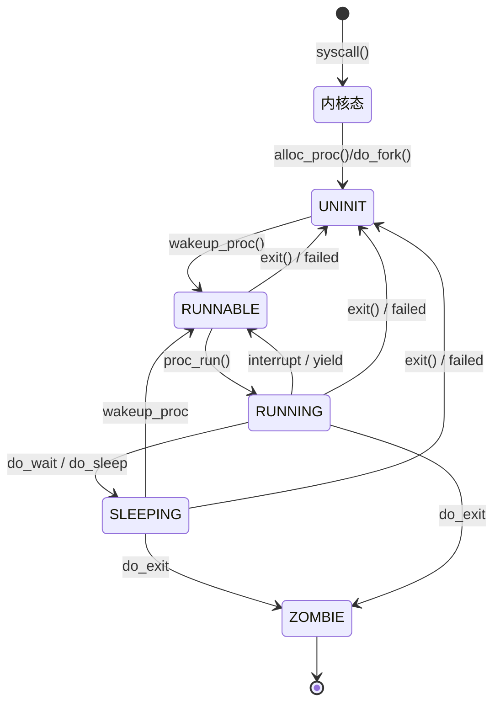

<h1><center>lab5实验报告</center></h1>
<h5><center>组员：杜鑫 胡博程 刘心源</center></h5>

## 实验目的

- 了解第一个用户进程创建过程
- 了解系统调用框架的实现机制
- 了解ucore如何实现系统调用sys_fork/sys_exec/sys_exit/sys_wait来进行进程管理


实验4完成了内核线程，但到目前为止，所有的运行都在内核态执行。实验5将创建用户进程，让用户进程在用户态执行，且在需要ucore支持时，可通过系统调用来让ucore提供服务。为此需要构造出第一个用户进程，并通过系统调用`sys_fork`/ sys_exec /sys_exit /sys_wait 来支持运行不同的应用程序，完成对用户进程的执行过程的基本管理。

本实验中第一个用户进程是由第二个内核线程initproc通过把hello应用程序执行码覆盖到initproc的用户虚拟内存空间来创建的


## 练习0：填写已有实验

本实验依赖实验1/2/3/4。请把你做的实验1/2/3/4的代码填入本实验中代码中有“LAB1”/“LAB2”/“LAB3”/“LAB4”的注释相应部分。注意：为了能够正确执行lab5的测试应用程序，可能需对已完成的实验1/2/3/4的代码进行进一步改进。

#### 合并并修改代码1——alloc_proc函数

```c++
// alloc_proc - alloc a proc_struct and init all fields of proc_struct
static struct proc_struct *
alloc_proc(void)
{
    struct proc_struct *proc = kmalloc(sizeof(struct proc_struct));
    if (proc != NULL)
    {
        proc->state = PROC_UNINIT; // 设置进程为初始态
        proc->pid = -1;            // 设置进程pid的未初始化值
        proc->runs = 0;
        proc->kstack = 0;
        proc->need_resched = 0;
        proc->parent = NULL;
        proc->mm = NULL;
        memset(&(proc->context), 0, sizeof(struct context));
        proc->tf = NULL;
        proc->cr3 = boot_cr3; // 使用内核页目录表的基址
        proc->flags = 0;
        memset(proc->name, 0, PROC_NAME_LEN);

        // 新增
        proc->wait_state = 0;                        // PCB新增的条目，初始化进程等待状态
        proc->cptr = proc->yptr = proc->optr = NULL; // 设置指针为空
        // ffang：这两行代码主要是初始化进程等待状态、和进程的相关指针，例如父进程、子进程、同胞等等。
        // 其中的wait_state是进程控制块中新增的条目。避免之后由于未定义或未初始化导致管理用户进程时出现错误。
    }
    return proc;
}
```

改进的内容为：

```c++
proc->wait_state = 0; //初始化进程等待状态
proc->cptr = proc->optr = proc->yptr = NULL; //指针初始化
```

代码用于初始化进程等待状态、和进程的相关指针，例如父进程、子进程、同胞等等。其中的wait_state是[进程控制块](https://so.csdn.net/so/search?q=进程控制块&spm=1001.2101.3001.7020)中新增的条目。避免之后由于未定义或未初始化导致管理用户进程时出现错误。

#### 合并并修改代码2——do_fork函数

```c++
int do_fork(uint32_t clone_flags, uintptr_t stack, struct trapframe *tf)
{
    int ret = -E_NO_FREE_PROC;
    struct proc_struct *proc;
    if (nr_process >= MAX_PROCESS)
    {
        goto fork_out;
    }
    ret = -E_NO_MEM;
    // LAB4:EXERCISE2 2112614

    //    1. call alloc_proc to allocate a proc_struct
    proc = alloc_proc(); // 本质上是用kmlloc函数分配了一块内存空间，然后将proc指向这块内存空间
    if (proc == NULL)
    {
        goto fork_out;
    }
    /*LAB5 UPDATE1: 2111194*/
    proc->parent = current;           // 将子进程的父进程设置为当前进程，后面用这个当前进程控制子进程的资源释放
    assert(current->wait_state == 0); // 确保进程在等待（确保当前进程的wait_state为0）

    //    2. call setup_kstack to allocate a kernel stack for child process
    ret = setup_kstack(proc);
    if (ret != 0)
    {
        goto bad_fork_cleanup_proc;
    }

    //    3. call copy_mm to dup OR share mm according clone_flag
    ret = copy_mm(clone_flags, proc); // 根据clone_flags决定是复制还是共享内存管理系统
    if (ret != 0)
    {
        goto bad_fork_cleanup_kstack;
    }

    //    4. call copy_thread to setup tf & context in proc_struct
    copy_thread(proc, stack, tf);

    //    5. insert proc_struct into hash_list && proc_list
    bool intr_flag;
    local_intr_save(intr_flag);
    {
        proc->pid = get_pid(); // 分配一个新的不重复的pid

        // list_add(&proc_list, &(proc->list_link));
        // nr_process++;
        /*LAB5 UPDATE2: 2111194*/
        // 将proc_struct插入到hash_list和proc_list中（上面已做），设置进程的关系链接
        set_links(proc); // 设置进程链接
        hash_proc(proc); // 将进程插入到hash_list中
    }
    local_intr_restore(intr_flag);

    //    6. call wakeup_proc to make the new child process RUNNABLE
    wakeup_proc(proc); // 设置proc的state为PROC_RUNNABLE，使得进程可以被调度执行

    //    7. set ret vaule using child proc's pid
    ret = proc->pid;


fork_out:
    return ret;

bad_fork_cleanup_kstack:
    put_kstack(proc);
bad_fork_cleanup_proc:
    kfree(proc);
    goto fork_out;
}
```

改进内容为：

```c++
assert(current->wait_state == 0); //确保进程在等待
set_links(proc); //设置进程链接
```

第一行代码需要确保当前进程正在等待，我们在alloc_proc中初始化wait_state为0。

#### 合并并修改代码3——proc_run、do_pgfault函数

直接填入lab4代码，不需要修改

#### 其他已经修改好的部分解释——interrupt_handler函数

```c++
void interrupt_handler(struct trapframe *tf)
{
    intptr_t cause = (tf->cause << 1) >> 1;
    switch (cause)
    {
    // ......代码省略
    case IRQ_S_TIMER:
        // "All bits besides SSIP and USIP in the sip register are
        // read-only." -- privileged spec1.9.1, 4.1.4, p59
        // In fact, Call sbi_set_timer will clear STIP, or you can clear it
        // directly.
        // clear_csr(sip, SIP_STIP);
        clock_set_next_event();
        if (++ticks % TICK_NUM == 0 && current)
        {
            // print_ticks();
            current->need_resched = 1;
        }
        break;
    // ......代码省略
    default:
        print_trapframe(tf);
        break;
    }
}
```

改动：

- 不输出“100ticks"
- 每100次时间中断后，当前正在执行的进程准备被调度，用于用户态线程切换
- 

## 练习1: 加载应用程序并执行（需要编码）

**do_execv**函数调用`load_icode`（位于kern/process/proc.c中）来加载并解析一个处于内存中的ELF执行文件格式的应用程序。你需要补充`load_icode`的第6步，建立相应的用户内存空间来放置应用程序的代码段、数据段等，且要设置好`proc_struct`结构中的成员变量trapframe中的内容，确保在执行此进程后，能够从应用程序设定的起始执行地址开始执行。需设置正确的trapframe内容。

请在实验报告中简要说明你的设计实现过程。

- 请简要描述这个用户态进程被ucore选择占用CPU执行（RUNNING态）到具体执行应用程序第一条指令的整个经过。


#### 1、编码思路

接着lab4的实验，本实验在init进程初始化并占用CPU之后，借由init进程fork用户进程，函数执行流为

`user_main`----->`kernel_execve`----->`sys_exec`----->`do_execve`----->`load_icode`

`user_main`函数：

```c++
user_main(void *arg)
{
#ifdef TEST
    KERNEL_EXECVE2(TEST, TESTSTART, TESTSIZE);
#else
    KERNEL_EXECVE(exit);
#endif
    panic("user_main execve failed.\n");
}
```

在`make grade`中指定了`TEST`，将会执行`forktest`用户进程，随后进入相应的宏定义

```c++
#define __KERNEL_EXECVE(name, binary, size) ({           \
    cprintf("kernel_execve: pid = %d, name = \"%s\".\n", \
            current->pid, name);                         \
    kernel_execve(name, binary, (size_t)(size));         \
})
```

进而进入`kernel_execve`函数，其中的内联汇编部分将会触发系统调用，随后调用函数`sys_exec`，进而调用函数`do_execve`

```c++
static int
sys_exec(uint64_t arg[])
{
    const char *name = (const char *)arg[0];
    size_t len = (size_t)arg[1];
    unsigned char *binary = (unsigned char *)arg[2];
    size_t size = (size_t)arg[3];
    return do_execve(name, len, binary, size);
}
```

`do_execve`函数主要做的工作就是先回收自身所占用户空间，然后调用`load_icode`，用新的程序覆盖内存空间，形成一个执行新程序的新进程。

```c++
int do_execve(const char *name, size_t len, unsigned char *binary, size_t size)
{
    struct mm_struct *mm = current->mm;
    if (!user_mem_check(mm, (uintptr_t)name, len, 0)) // 检查用户空间的内存是否合法
    {
        return -E_INVAL;
    }
    if (len > PROC_NAME_LEN)
    {
        len = PROC_NAME_LEN;
    }

    char local_name[PROC_NAME_LEN + 1];
    memset(local_name, 0, sizeof(local_name));
    memcpy(local_name, name, len);
    // 如果mm不为NULL，则清空mm
    if (mm != NULL)
    {
        cputs("mm != NULL");
        // 将cr3页表基址指向boot_cr3,即内核页表
        lcr3(boot_cr3);            // cr3寄存器载入内核页表地址，表明转入内核态
        if (mm_count_dec(mm) == 0) // 如果mm的引用计数为0，则清空mm
        {
            ////下面三步实现将进程的内存管理区域清空
            exit_mmap(mm);  // 清空内存管理部分和对应页表
            put_pgdir(mm);  // 清空页表
            mm_destroy(mm); // 清空缓存
        }
        current->mm = NULL;
    }
    int ret;
    // load_icode函数会加载并解析一个处于内存中的ELF执行文件格式的应用程序，建立相应的用户内存空间来放置应用程序的代码段、数据段等
    if ((ret = load_icode(binary, size)) != 0)
    {
        goto execve_exit;
    }
    // 给进程新的名字
    set_proc_name(current, local_name);
    return 0;

execve_exit:
    do_exit(ret);
    panic("already exit: %e.\n", ret);
}
```

接下来的`load_icode`函数主要负责加载并解析一个处于内存中的ELF执行文件格式的应用程序，建立相应的用户内存空间来放置应用程序的代码段、数据段等

函数主要功能如下

1. 为用户进程创建新的mm结构
2. 创建页目录表
3. 校验ELF文件的魔数是否正确
4. 创建虚拟内存空间，即往mm结构体添加vma结构
5. 分配内存，并拷贝ELF文件的各个program section到新申请的内存上
6. 为BSS section分配内存，并初始化为全0
7. 分配用户栈内存空间
8. 设置当前用户进程的mm结构、页目录表的地址及加载页目录表地址到cr3寄存器
9. 设置当前用户进程的tf结构

```c++
static int
load_icode(unsigned char *binary, size_t size)
{
    if (current->mm != NULL)
    {
        panic("load_icode: current->mm must be empty.\n");
    }

    int ret = -E_NO_MEM;
    struct mm_struct *mm;
    //(1) create a new mm for current process
    if ((mm = mm_create()) == NULL)
    {
        goto bad_mm;
    }
    //(2) create a new PDT, and mm->pgdir= kernel virtual addr of PDT
    if (setup_pgdir(mm) != 0) // 其实就是alloc一页然后将页目录表的基址赋值给mm->pgdir
    {
        goto bad_pgdir_cleanup_mm;
    }
    //(3) copy TEXT/DATA section, build BSS parts in binary to memory space of process
    struct Page *page;
    // 代码省略......
    //(4) build user stack memory
    vm_flags = VM_READ | VM_WRITE | VM_STACK;
    if ((ret = mm_map(mm, USTACKTOP - USTACKSIZE, USTACKSIZE, vm_flags, NULL)) != 0)
    {
        goto bad_cleanup_mmap;
    }
    assert(pgdir_alloc_page(mm->pgdir, USTACKTOP - PGSIZE, PTE_USER) != NULL);
    assert(pgdir_alloc_page(mm->pgdir, USTACKTOP - 2 * PGSIZE, PTE_USER) != NULL);
    assert(pgdir_alloc_page(mm->pgdir, USTACKTOP - 3 * PGSIZE, PTE_USER) != NULL);
    assert(pgdir_alloc_page(mm->pgdir, USTACKTOP - 4 * PGSIZE, PTE_USER) != NULL);

    //(5) set current process's mm, sr3, and set CR3 reg = physical addr of Page Directory
    mm_count_inc(mm);
    current->mm = mm;
    current->cr3 = PADDR(mm->pgdir);
    lcr3(PADDR(mm->pgdir));

    //(6) setup trapframe for user environment
    struct trapframe *tf = current->tf;
    // Keep sstatus
    uintptr_t sstatus = tf->status;
    memset(tf, 0, sizeof(struct trapframe));
    /* LAB5:EXERCISE1 2111194
     * should set tf->gpr.sp, tf->epc, tf->status
     * NOTICE: If we set trapframe correctly, then the user level process can return to USER MODE from kernel. So
     *          tf->gpr.sp should be user stack top (the value of sp)
     *          tf->epc should be entry point of user program (the value of sepc)
     *          tf->status should be appropriate for user program (the value of sstatus)
     *          hint: check meaning of SPP, SPIE in SSTATUS, use them by SSTATUS_SPP, SSTATUS_SPIE(defined in risv.h)
     */
    tf->gpr.sp = USTACKTOP;
    tf->epc = elf->e_entry;
    tf->status = (read_csr(sstatus) | SSTATUS_SPIE) & ~SSTATUS_SPP;
    ret = 0;
out:
    return ret;
bad_cleanup_mmap:
    exit_mmap(mm);
bad_elf_cleanup_pgdir:
    put_pgdir(mm);
bad_pgdir_cleanup_mm:
    mm_destroy(mm);
bad_mm:
    goto out;
}
```

需要我们补充的部分为第六部分—— 设置用户程序的入口地址、用户栈指针和状态寄存器等信息

```c++
struct trapframe *tf = current->tf;
tf->gpr.sp = USTACKTOP;
tf->epc = elf->e_entry;
tf->status = (read_csr(sstatus) | SSTATUS_SPIE ) & ~SSTATUS_SPP;
```

- `tf->gpr.sp` ：设置用户栈指针为用户栈的顶部。
- `tf->epc` ：设置用户程序的入口地址。
- `tf->status` ：设置状态寄存器，确保用户程序在用户态运行，并开启中断


#### 2、简述经过

1. **进程创建和等待：**

   - **Initproc 和 Userproc：** 内核线程 `initproc` 完成用户态进程 `userproc` 的创建。
   - **等待子进程：** `initproc` 接着调用 `do_wait` 函数，等待有 `RUNNABLE` 状态的子进程出现。

2. **进程调度和运行：**

   - **启动新线程：** 一旦 `do_wait` 确认存在 `RUNNABLE` 子进程，schedule 函数便被激活。

   - `proc_run` 功能：

      `schedule` 通过 `proc_run` 来运行新线程。`proc_run` 执行三个主要操作：

     - 设定 `userproc` 的栈指针。
     - 重新加载与用户态相关的页目录表。
     - 切换到 `userproc` 的上下文，并跳至 `forkret` 函数。

3. **进程切换和系统调用处理：**

   - **处理 forkrets 和 __trapret：** `forkret` 调用 `forkrets` 函数，进而跳到 `__trapret`。这里，`userproc->tf` 的内容被恢复到寄存器，并通过 `iret` 指令跳转到 `kernel_thread_entry`。
   - **kernel_thread_entry 的任务：** 这个函数先压栈再跳转到 `user_main` 函数。
   - **执行 user_main 和 kernel_execve：** `user_main` 打印进程信息后，调用 `kernel_execve` 执行 `exec` 系统调用。

4. **应用程序加载和执行：**

   - **do_execve 函数：** CPU 在捕捉到系统调用后，进行一系列的函数跳转，最终进入 `do_execve`。
   - **内存空间处理：** `do_execve` 检查并释放虚拟内存空间，包括 vma、mm 和页目录表。
   - **加载应用程序：** 通过 `load_icode` 加载应用程序，创建新的 mm 结构和页目录表，分配内存并初始化 BSS section。
   - **设置进程状态：** 加载页目录表到 cr3 寄存器，设置用户进程的 tf 结构。

5. **从内核态到用户态的转换：**

   - **__trapret 的角色：** 最后，程序返回到 `__trapret` 函数，从 `userproc->tf.tf_eip` 跳转到应用程序入口，如 exit.c 文件中的 main 函数。
   - **寄存器状态维护：** 这个过程中，`alltraps` 和 `trapret` 函数巧妙地维持了中断处理前后各寄存器的状态，同时实现了从内核态到用户态的平滑过渡。


## 练习2: 父进程复制自己的内存空间给子进程（需要编码）

创建子进程的函数`do_fork`在执行中将拷贝当前进程（即父进程）的用户内存地址空间中的合法内容到新进程中（子进程），完成内存资源的复制。具体是通过`copy_range`函数（位于kern/mm/pmm.c中）实现的，请补充`copy_range`的实现，确保能够正确执行。

请在实验报告中简要说明你的设计实现过程。

- 如何设计实现`Copy on Write`机制？给出概要设计，鼓励给出详细设计。

> Copy-on-write（简称COW）的基本概念是指如果有多个使用者对一个资源A（比如内存块）进行读操作，则每个使用者只需获得一个指向同一个资源A的指针，就可以该资源了。若某使用者需要对这个资源A进行写操作，系统会对该资源进行拷贝操作，从而使得该“写操作”使用者获得一个该资源A的“私有”拷贝—资源B，可对资源B进行写操作。该“写操作”使用者对资源B的改变对于其他的使用者而言是不可见的，因为其他使用者看到的还是资源A。


#### 1、编码思路

函数调用过程如下

```c++
do_fork()---->copy_mm()---->dup_mmap()---->copy_range()
```

`do_fork`函数用于为一个新的子进程创建父进程

其执行流如下：

1. 检查当前进程数量是否已达到最大值（`MAX_PROCESS`）。如果是，则返回错误`-E_NO_FREE_PROC`并跳转到`fork_out`。
2. 调用`alloc_proc`函数分配一个新的进程结构（`proc_struct`）。如果分配失败（返回NULL），则跳转到`fork_out`。
3. 设置新进程的父进程为当前进程，并确保当前进程的`wait_state`为0。
4. 调用`setup_kstack`函数为新进程分配一个内核栈。如果分配失败，则跳转到`bad_fork_cleanup_proc`。
5. 调用`copy_mm`函数根据`clone_flags`复制或共享内存管理结构。如果复制失败，则跳转到`bad_fork_cleanup_kstack`。
6. 调用`copy_thread`函数设置新进程的陷阱帧和上下文。
7. 分配一个新的不重复的进程ID（`pid`），并将新进程插入到进程哈希列表和进程列表中。
8. 调用`wakeup_proc`函数将新进程的状态设置为可运行（`PROC_RUNNABLE`）。
9. 将返回值设置为新进程的`pid`

在调用`copy_mm`函数的时候进一步调用了`dup_mmap`函数，其内调用了`copy_range`函数

其实`copy_range`函数就是调用一个memcpy将父进程的内存直接复制给子进程

```c++
int copy_range(pde_t *to, pde_t *from, uintptr_t start, uintptr_t end, bool share)
{
    // 确保start和end可以整除PGSIZE
    assert(start % PGSIZE == 0 && end % PGSIZE == 0);
    assert(USER_ACCESS(start, end));
    // //以页为单位进行复制
    do
    {
        // call get_pte to find process A's pte according to the addr start
        // 得到A&B的pte地址
        pte_t *ptep = get_pte(from, start, 0), *nptep;
        if (ptep == NULL)
        {
            start = ROUNDDOWN(start + PTSIZE, PTSIZE);
            continue;
        }
        // call get_pte to find process B's pte according to the addr start. If
        // pte is NULL, just alloc a PT
        if (*ptep & PTE_V)
        {
            if ((nptep = get_pte(to, start, 1)) == NULL)
            {
                return -E_NO_MEM;
            }
            uint32_t perm = (*ptep & PTE_USER);
            // get page from ptep
            struct Page *page = pte2page(*ptep);
            // alloc a page for process B
            struct Page *npage = alloc_page();
            assert(page != NULL);
            assert(npage != NULL);
            int ret = 0;
            // 1.找寻父进程的内核虚拟页地址
            void *kva_src = page2kva(page);
            // 2.找寻子进程的内核虚拟页地址
            void *kva_dst = page2kva(npage);
            // 3.复制父进程内容到子进程
            memcpy(kva_dst, kva_src, PGSIZE);
            // 4.建立物理地址与子进程的页地址起始位置的映射关系
            ret = page_insert(to, npage, start, perm);

            assert(ret == 0);
        }
        start += PGSIZE;
    } while (start != 0 && start < end);
    return 0;
}
```

具体实现就是：

1. `void *kva_src = page2kva(page);`：获取父进程的内存页对应的内核虚拟地址。`page`是父进程的内存页，`page2kva`函数将页结构转换为对应的内核虚拟地址。
2. `void *kva_dst = page2kva(npage);`：获取子进程的内存页对应的内核虚拟地址。`npage`是新分配给子进程的内存页。
3. `memcpy(kva_dst, kva_src, PGSIZE);`：将父进程的内存页内容复制到子进程的内存页。`kva_src`是源地址（父进程的内存页），`kva_dst`是目标地址（子进程的内存页），`PGSIZE`是要复制的数据的大小（一个页的大小）。
4. `ret = page_insert(to, npage, start, perm);`：将子进程的内存页插入到子进程的页表中。`to`是子进程的内存管理结构，`npage`是子进程的内存页，`start`是虚拟地址，`perm`是页的权限。


#### 2、简述Copy on Write机制

**Copy on Write**核心思想是在资源真正需要修改之前，不复制资源。所以设计的时候从以下方面进行

1. 当多个进程需要读取同一个资源（如内存页）时，它们初始时共享同一份资源的拷贝，而不是各自持有独立的副本。
2. 只有当其中一个进程尝试修改这个共享资源时，系统才会创建一个新的资源副本。

所以提出这样的设计思路

1. **设置共享内存标记：**
   - **共享标记：** 在进程管理的功能中，尤其是在处理内存映射（如在 `dup_mmap` 函数中）时，引入一个标记位（比如 `share`）来标识某块内存是否为共享。这个标记的初始设置为 1，意味着这块内存默认是可以被共享的。
2. **处理共享页面的复制：**
   - **共享页映射：** 在物理内存管理模块（如 `pmm.c`）中，为 `copy_range` 函数添加对共享页的特殊处理。当 `share` 为 1，即页面被标记为共享时，子进程的页面不是独立复制，而是直接映射到父进程相同的物理页面。
   - **只读权限：** 由于共享页面同时被父子进程访问，为防止任一进程的写操作影响到另一个进程，将这些共享页面的权限设置为只读。这样，任何试图修改这些页面的写操作都会被操作系统拦截。
3. **页面错误处理：**
   - **写操作触发页面错误：** 当任一进程尝试对这些被标记为只读的共享页面进行写操作时，操作系统会触发页面错误（Page Fault）。
   - **检测并响应：** 页面错误处理机制会识别这种错误为一次试图写入共享页面的操作。在这种情况下，操作系统会采取特定的措施，如为执行写操作的进程分配一个新的物理页面。
   - **复制和重新映射：** 接着，操作系统会将原共享页面的内容复制到新分配的页面中，并更新引起页面错误的进程的内存映射，使其指向这个新的物理页面。这样，进程就可以在新页面上执行其写操作，而不影响其他共享原页面的进程。


## 练习3: 阅读分析源代码，理解进程执行 fork/exec/wait/exit 的实现，以及系统调用的实现（不需要编码）

请在实验报告中简要说明你对 fork/exec/wait/exit函数的分析。并回答如下问题：

- 请分析fork/exec/wait/exit的执行流程。重点关注哪些操作是在用户态完成，哪些是在内核态完成？内核态与用户态程序是如何交错执行的？内核态执行结果是如何返回给用户程序的？
- 请给出ucore中一个用户态进程的执行状态生命周期图（包执行状态，执行状态之间的变换关系，以及产生变换的事件或函数调用）。（字符方式画即可）

执行：make grade。如果所显示的应用程序检测都输出ok，则基本正确。（使用的是qemu-1.0.1）


#### 1、fork函数

执行流程：

```c++
fork->SYS_fork->do_fork+wakeup_proc->syscall(SYS_fork)->ecall
```

在用户态：父进程init调用fork函数，随后触发系统调用SYS_fork进入内核态；

内核态：do_fork函数复制init进程的所有资源如mm、文件信息等，还会新建`proc_struct`和子进程的内核栈，这样就创建一个子进程，随后fork调用返回，程序将回到用户态

用户态：通过fork函数得到了新进程PID


#### 2、exec函数

执行流程：

```c++
user_main()->kernel_execve()->ebreak->syscall()->SYS_exec->do_execve
```

在用户态：父进程将PC放在`user_main`函数处，通过宏定义进行系统调用，进入`kernel_execve()`。

内核态：`kernel_execve()`通过`ebreak`进行系统调用，进而调用 `load_icode` 函数加载二进制文件，随后执行用户进程


#### 3、wait函数

```c++
wait()->sys_wait()->do_wait
```

用户态：执行wait函数，随后使用系统调用进入`sys_wait`函数，此时进入内核态

内核态：调用`do_wait`函数，让父进程休眠并调度，等待这子进程的退出

用户态：`do_wait`函数退出后将释放子进程的内核堆栈、子进程的进程控制块，此时回到用户态的`wait`函数返回的地方，继续执行用户态函数中`wait`函数返回后面的代码


#### 4、exit函数

```c++
exit()->sys_exit()->do_exit()
```

用户态：执行exit函数，随后使用系统调用进入`sys_exit`函数，此时进入内核态

内核态：调用`do_exit`函数，释放进程的虚拟内存空间、调用调度函数进行调度，选择新的进程去执行

用户态：`do_exit`函数退出后将回到用户态的`wait`函数返回的地方，继续执行用户态函数中`exit`函数返回后面的代码


#### 5、内核态执行结果如何返回给用户态程序

通过中断和异常机制反馈给用户态。内核利用特定的数据结构（例如进程控制块和中断帧）来记录用户程序的当前状态。完成系统调用之后，内核通过中断返回指令（IRET）将执行流程交回用户程序，并利用之前保存的状态信息恢复用户程序的执行环境，从而使用户程序能够从中断点继续运行。


#### 6、用户态进程生命周期图



#### 7、结果展现

`make grade`结果


`make qemu`结果


## 扩展练习 Challenge2

说明该用户程序是何时被预先加载到内存中的？与我们常用操作系统的加载有何区别，原因是什么？


#### 1、何时载入内存

应当是在整个项目编译的时候载入内存的，在宏定义`KERNEL_EXECVE`我们可以发现用户态的程序载入其实是通过特定的编译输出文件，此次实验更改了Makefile，并且通过ld指令将用户态程序（user文件夹下的代码）编译链接到项目中。所以在ucore启动的时候用户程序就被加载在内存中了。

#### 2、与常用操作系统的加载的区别与原因

- 区别：常规OS中，应用程序会在被需要时才加载到内存中，只有用户需要运行程序，OS才会加载程序到内存
- 原因：我们的用户进程程序并不是通过调度找到的，是直接由init进程fork出来的，本次实验的项目中我们只实现了从内核态的init进程出发执行用户进程，没有实现用户进程间的调度，直接将用户程序加载到内存方便了代码实现


## 涉及的知识点

#### 1、子进程的退出码

子进程的退出码（exit code）是当一个进程结束时返回给其父进程的一个特定值，用于表示子进程的结束状态。这个值对于父进程来说非常重要，因为它提供了关于子进程结束方式的信息。退出码的含义如下：

1. **成功或正常结束**:
   - 通常，如果子进程成功完成其任务并正常退出，它会返回一个 `0` 值，表示“成功”或“没有错误”。
2. **错误或异常结束**:
   - 如果子进程因为某种错误或异常情况而结束，它会返回一个非零值。这个非零值通常指定了特定的错误码或结束原因。
   - 不同的非零值可以表示不同类型的错误，例如，`1` 可能表示一般性错误，而其他值可能指代特定的错误条件或异常。
3. **由信号结束**:
   - 如果子进程因为接收到一个信号而结束（例如，被强制终止），退出码可能包含关于该信号的信息。
4. **自定义退出码**:
   - 子进程可以使用自定义的退出码来表示特定的结束状态或结果。这些值可以由开发者根据应用程序的逻辑自定义。
