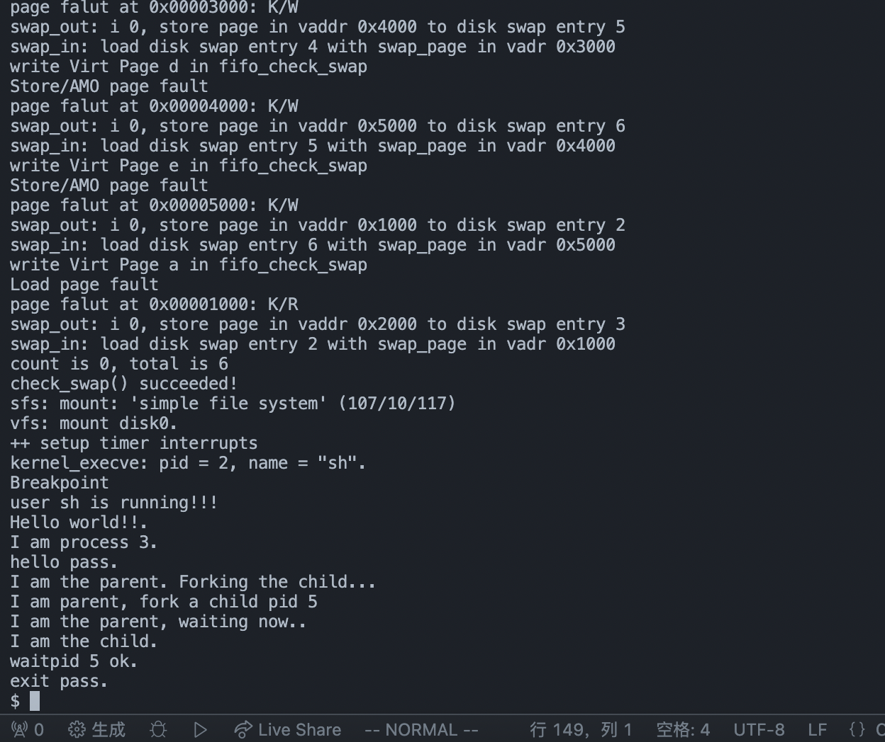
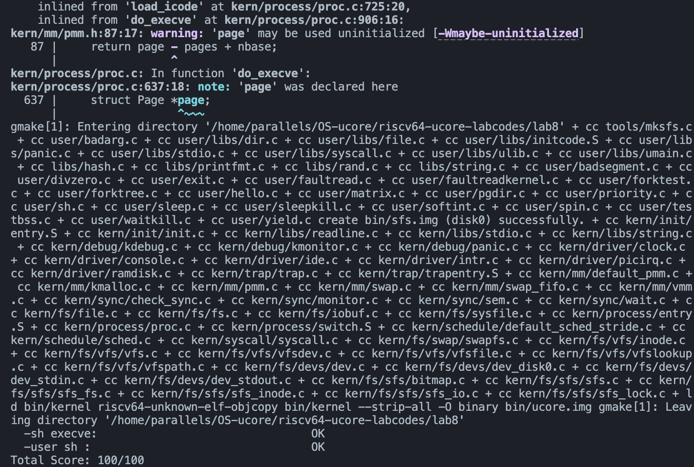
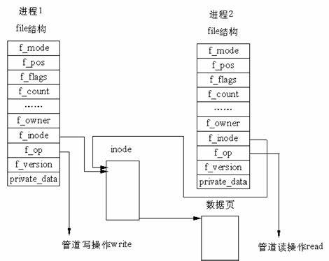
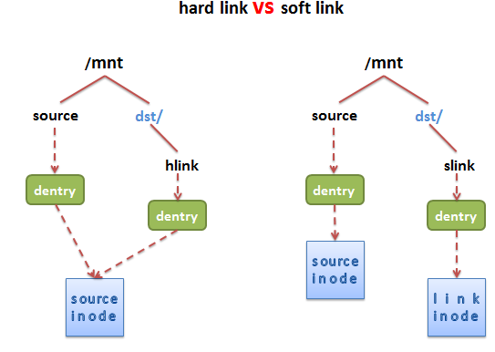

<h1><center>lab5实验报告</center></h1>
<h5><center>组员：杜鑫 胡博程 刘心源</center></h5>


## 一、一些先验知识

#### 1、ucore 的文件系统架构

主要由四部分组成：

- **通用文件系统访问接口层**：该层提供了一个从用户空间到文件系统的标准访问接口。这一层访问接口让应用程序能够通过一个简单的接口获得 ucore 内核的文件系统服务。
- **文件系统抽象层**：向上提供一个一致的接口给内核其他部分（文件系统相关的系统调用实现模块和其他内核功能模块）访问。向下提供一个同样的抽象函数指针列表和数据结构屏蔽不同文件系统的实现细节。
- **Simple FS 文件系统层**：一个基于索引方式的简单文件系统实例。向上通过各种具体函数实现以对应文件系统抽象层提出的抽象函数。向下访问外设接口
- **外设接口层**：向上提供 device 访问接口屏蔽不同硬件细节。向下实现访问各种具体设备驱动的接口，比如 disk 设备接口/串口设备接口/键盘设备接口等。


#### 2、文件系统数据结构

ucore 中的文件系统架构包含四类主要的数据结构, 它们分别是：

- **超级块（SuperBlock**），它主要从文件系统的全局角度描述特定文件系统的全局信息。它的作用范围是整个 OS 空间。
- **索引节点**（inode）：它主要从文件系统的单个文件的角度它描述了文件的各种属性和数据所在位置。它的作用范围是整个 OS 空间。
- **目录项**（dentry）：它主要从文件系统的文件路径的角度描述了文件路径中的一个特定的目录项（注：一系列目录项形成目录/文件路径）。它的作用范围是整个 OS 空间。对于 SFS 而言，inode(具体为 struct sfs_disk_inode)对应于物理磁盘上的具体对象，dentry（具体为 struct sfs_disk_entry）是一个内存实体，其中的 ino 成员指向对应的 inode number，另外一个成员是 file name(文件名).
- **文件**（file），它主要从进程的角度描述了一个进程在访问文件时需要了解的文件标识，文件读写的位置，文件引用情况等信息。它的作用范围是某一具体进程。

通常文件系统中，磁盘的使用是以扇区（Sector）为单位的，但是为了实现简便，SFS 中以 block （4K，与内存 page 大小相等）为基本单位。

SFS 文件系统的布局如下表所示。

| superblock | root-dir inode | freemap    | inode、File Data、Dir Data Blocks |
| ---------- | -------------- | ---------- | --------------------------------- |
| 超级块     | 根目录索引节点 | 空闲块映射 | 目录和文件的数据和索引节点        |

第 0 个块（4K）是超级块（superblock），它包含了关于文件系统的所有关键参数，当计算机被启动或文件系统被首次接触时，超级块的内容就会被装入内存。其定义如下：

```c++
struct sfs_super {
    uint32_t magic;                                  /* magic number, should be SFS_MAGIC */
    uint32_t blocks;                                 /* # of blocks in fs */
    uint32_t unused_blocks;                         /* # of unused blocks in fs */
    char info[SFS_MAX_INFO_LEN + 1];                /* infomation for sfs  */
};
```

可以看到，包含一个成员变量魔数 magic，其值为 0x2f8dbe2a，内核通过它来检查磁盘镜像是否是合法的 SFS img；成员变量 blocks 记录了 SFS 中所有 block 的数量，即 img 的大小；成员变量 unused_block 记录了 SFS 中还没有被使用的 block 的数量；成员变量 info 包含了字符串”simple file system”。

第 1 个块放了一个 root-dir 的 inode，用来记录根目录的相关信息。有关 inode 还将在后续部分介绍。这里只要理解 root-dir 是 SFS 文件系统的根结点，通过这个 root-dir 的 inode 信息就可以定位并查找到根目录下的所有文件信息。

从第 2 个块开始，根据 SFS 中所有块的数量，用 1 个 bit 来表示一个块的占用和未被占用的情况。这个区域称为 SFS 的 freemap 区域，这将占用若干个块空间。为了更好地记录和管理 freemap 区域，专门提供了两个文件 kern/fs/sfs/bitmap.[ch]来完成根据一个块号查找或设置对应的 bit 位的值。

最后在剩余的磁盘空间中，存放了所有其他目录和文件的 inode 信息和内容数据信息。需要注意的是虽然 inode 的大小小于一个块的大小（4096B），但为了实现简单，每个 inode 都占用一个完整的 block。

**超级块super_block**

**文件file** 进程访问的单个文件信息

**索引节点inode ** 内存里的索引节点,封装了不同文件系统的索引节点


#### 3、文件系统布局

文件系统通常保存在磁盘上。在本实验中，第三个磁盘（即disk0，前两个磁盘分别是 ucore.img 和 swap.img）用于存放一个SFS文件系统（Simple Filesystem）。通常文件系统中，磁盘的使用是以扇区（Sector）为单位的，但是为了实现简便，SFS 中以 block （4K，与内存 page 大小相等）为基本单位。

SFS文件系统的布局如下

```
+------------+----------+---------+-------------------------------------+
| superblock | root-dir | freemap | Inode / File Data / Dir Data blocks |
+------------+----------+---------+-------------------------------------+
```

- 第0个块（4K）是超级块（superblock），它包含了关于文件系统的所有关键参数，当计算机被启动或文件系统被首次接触时，超级块的内容就会被装入内存。其定义如下：

  ```c
  /*
   * On-disk superblock
  */
  struct sfs_super {
      // 超级块结构中包含成员变量魔数magic，内核通过它来检查磁盘镜像是否是合法的 SFS img
      uint32_t magic;                                 /* magic number, should be SFS_MAGIC */
      uint32_t blocks;                                /* # of blocks in fs */
      uint32_t unused_blocks;                         /* # of unused blocks in fs */
      char info[SFS_MAX_INFO_LEN + 1];                /* infomation for sfs  */
  };
  ```

- 第1个块放了一个root-dir的inode，用来记录根目录的相关信息。root-dir是SFS文件系统的根结点，通过这个root-dir的inode信息就可以定位并查找到根目录下的所有文件信息。

- 从第2个块开始，根据SFS中所有块的数量，用1个bit来表示一个块的占用和未被占用的情况。这个区域称为SFS的freemap区域，这将占用若干个块空间。为了更好地记录和管理freemap区域

- 最后在剩余的磁盘空间中，存放了所有其他目录和文件的inode信息和内容数据信息。需要注意的是虽然inode的大小小于一个块的大小（4096B），但为了实现简单，每个 inode 都占用一个完整的 block


## 二、练习0：填写已有实验

> 本实验依赖实验1/2/3/4/5/6/7。请把你做的实验1/2/3/4/5/6/7的代码填入本实验中代码中有“LAB1”/“LAB2”/“LAB3”/“LAB4”/“LAB5”/“LAB6” /“LAB7”的注释相应部分。并确保编译通过。注意：为了能够正确执行lab8的测试应用程序，可能需对已完成的实验1/2/3/4/5/6/7的代码进行进一步改进。

需要补充和修改的代码有：

- **proc.c**
- **default_pmm.c**
- **pmm.c**
- **swap_fifo.c**
- **vmm.c**
- **trap.c**
- **sche.c**
- **monitor.c**
- **check_sync.c**

需要补充的函数有：proc.c/alloc_proc()、proc.c/do_fork、pmm.c/copy_range、default_sched_stride.c/stride_init、default_sched_stride.c/stride_enqueue、default_sched_stride.c/stride_dequeue、default_sched_stride.c/stride_pick_next、default_sched_stride.c/stride_proc_tick、lab6用的一个宏BIG_STRIDE


## 三、练习1: 完成读文件操作的实现（需要编码）

> 首先了解打开文件的处理流程，然后参考本实验后续的文件读写操作的过程分析，填写在 kern/fs/sfs/sfs_inode.c中 的sfs_io_nolock()函数，实现读文件中数据的代码。

#### 1、打开文件的处理流程

基于ucore四层文件系统结构，一个文件的打开流程经过下面的几部分

##### （1）接口层

用户进程的`open`函数（如sh.c中的`open(filename, open_flags)`）----->`sys_open()`----->`syscall`----->进入内核态----->`sysfile_open()`----->`file_open()`

用户会在进程中调用 `open()`函数，随后将一步步到调用syscall使得系统进入内核状态，调用抽象文件系统为接口层准备的接口函数`sysfile_open()`进而调用`file_open()`函数来到抽象层

##### （2）抽象层（VFS）

`file_open()`----->`vfs_open()`----->`vfs_lookup()`----->`vop_open`----->----->

- 在`file_open`函数中，程序主要做了以下几个操作：

  - 在当前进程的文件管理结构`filesp`中，获取一个空闲的`file`对象。
  - 调用`vfs_open`函数，并存储该函数返回的`inode`结构
  - 根据上一步返回的`inode`，设置`file`对象的属性。如果打开方式是`append`，则还会设置`file`的`pos`成员为当前文件的大小。
  - 最后返回`file->fd`

  ```c++
  int
  file_open(char *path, uint32_t open_flags) {
      bool readable = 0, writable = 0;
      switch (open_flags & O_ACCMODE) {
      case O_RDONLY: readable = 1; break;
      case O_WRONLY: writable = 1; break;
      case O_RDWR:
          readable = writable = 1;
          break;
      default:
          return -E_INVAL;
      }
  
      int ret;
      struct file *file;
      if ((ret = fd_array_alloc(NO_FD, &file)) != 0) {
          return ret;
      }
  
      struct inode *node;
      if ((ret = vfs_open(path, open_flags, &node)) != 0) {
          fd_array_free(file);
          return ret;
      }
  
      file->pos = 0;
      if (open_flags & O_APPEND) {
          struct stat __stat, *stat = &__stat;
          if ((ret = vop_fstat(node, stat)) != 0) {
              vfs_close(node);
              fd_array_free(file);
              return ret;
          }
          file->pos = stat->st_size;
      }
  
      file->node = node;
      file->readable = readable;
      file->writable = writable;
      fd_array_open(file);
      return file->fd;
  }
  ```

- `vfs_open`函数主要完成以下操作：

  - 调用`vfs_lookup`搜索给出的路径，判断是否存在该文件。如果存在，则`vfs_lookup`函数返回该文件所对应的`inode`节点至当前函数`vfs_open`中的局部变量`node`。

  - 如果给出的路径不存在，即文件不存在，则根据传入的flag，选择调用`vop_create`创建新文件或直接返回错误信息。

    > `vop_creat`所对应的`SFS`创建文件函数似乎没实现？

  - 执行到此步时，当前函数中的局部变量`node`一定非空，此时进一步调用`vop_open`函数打开文件。

    > SFS中，`vop_open`所对应的`sfs_openfile`不执行任何操作，但该接口仍然需要保留。

  - 如果文件打开正常，则根据当前函数传入的`open_flags`参数来判断是否需要将当前文件截断（truncate）至0（即**清空**）。如果需要截断，则执行`vop_truncate`函数。最后函数返回。

  ```c++
  int
  vfs_open(char *path, uint32_t open_flags, struct inode **node_store) {
      bool can_write = 0;
      switch (open_flags & O_ACCMODE) {
      case O_RDONLY:
          break;
      case O_WRONLY:
      case O_RDWR:
          can_write = 1;
          break;
      default:
          return -E_INVAL;
      }
  
      if (open_flags & O_TRUNC) {
          if (!can_write) {
              return -E_INVAL;
          }
      }
  
      int ret;
      struct inode *node;
      bool excl = (open_flags & O_EXCL) != 0;
      bool create = (open_flags & O_CREAT) != 0;
      ret = vfs_lookup(path, &node);
  
      if (ret != 0) {
          if (ret == -16 && (create)) {
              char *name;
              struct inode *dir;
              if ((ret = vfs_lookup_parent(path, &dir, &name)) != 0) {
                  return ret;
              }
              ret = vop_create(dir, name, excl, &node);
          } else return ret;
      } else if (excl && create) {
          return -E_EXISTS;
      }
      assert(node != NULL);
  
      if ((ret = vop_open(node, open_flags)) != 0) {
          vop_ref_dec(node);
          return ret;
      }
  
      vop_open_inc(node);
      if (open_flags & O_TRUNC || create) {
          if ((ret = vop_truncate(node, 0)) != 0) {
              vop_open_dec(node);
              vop_ref_dec(node);
              return ret;
          }
      }
      *node_store = node;
      return 0;
  }
  ```

  

- 文件打开操作到这里就差不多结束了，不过我们可以探讨一下文件是如何进行路径查找以及清空当前文件的。

  - `vfs_lookup`用于查找传入的路径，并返回其对应的`inode`结点。

    - 该函数首先调用`get_device`函数获取设备的`inode`结点。在`get_device`函数中，程序会分析传入的`path`结构并执行不同的函数。传入的`path`与对应的操作有以下三种，分别是

      - `directory/filename`： 相对路径。此时会进一步调用`vfs_get_curdir`，并最终获取到当前进程的工作路径并返回对应的`inode`。

      - `/directory/filename`或者`:directory/filename`：无设备指定的绝对路径。

        - 若路径为`/directory/filename`，此时返回`bootfs`根目录所对应的`inode`。

          > `bootfs`是内核启动盘所对应的文件系统。

        - 若路径为`:/directory/filename`，则获取当前进程工作目录所对应的文件系统根目录，并返回其`inode`数据。

      - `device:directory/filename`或者`device:/directory/filename`： 指定设备的绝对路径。返回所指定设备根目录的对应`inode`。

      > 总的来说，`get_device`返回的是一个目录`inode`结点。

      `get_device`函数代码如下：

      ```
      COPY/*
       * get_device- Common code to pull the device name, if any, off the front of a
       *             path and choose the inode to begin the name lookup relative to.
      */
      
      static int
      get_device(char *path, char **subpath, struct inode **node_store) {
          int i, slash = -1, colon = -1;
          for (i = 0; path[i] != '\0'; i ++) {
              if (path[i] == ':') { colon = i; break; }
              if (path[i] == '/') { slash = i; break; }
          }
          if (colon < 0 && slash != 0) {
              /* *
               * No colon before a slash, so no device name specified, and the slash isn't leading
               * or is also absent, so this is a relative path or just a bare filename. Start from
               * the current directory, and use the whole thing as the subpath.
               * */
              *subpath = path;
              return vfs_get_curdir(node_store);
          }
          if (colon > 0) {
              /* device:path - get root of device's filesystem */
              path[colon] = '\0';
      
              /* device:/path - skip slash, treat as device:path */
              while (path[++ colon] == '/');
                *subpath = path + colon;
              return vfs_get_root(path, node_store);
          }
      
          /* *
           * we have either /path or :path
           * /path is a path relative to the root of the "boot filesystem"
           * :path is a path relative to the root of the current filesystem
           * */
          int ret;
          if (*path == '/')
              if ((ret = vfs_get_bootfs(node_store)) != 0)
                  return ret;
          else {
              assert(*path == ':');
              struct inode *node;
              if ((ret = vfs_get_curdir(&node)) != 0)
                  return ret;
              /* The current directory may not be a device, so it must have a fs. */
              assert(node->in_fs != NULL);
              *node_store = fsop_get_root(node->in_fs);
              vop_ref_dec(node);
          }
      
          /* ///... or :/... */
          while (*(++ path) == '/');
          *subpath = path;
          return 0;
      }
      ```

    - 之后，该函数调用`vop_lookup`(实际是`sfs_lookup`)来获取目的结点。

  - `vop_truncate`函数（即`sfs_truncfile`函数）主要完成以下操作

    - 获取该文件原先占用磁盘的块数`nblks`，以及”截断“后占用的块数`tblks`。

      > 注意这个截断操作可以向后截断（即缩小文件大小），也可向前截断（即增大文件大小）。这里的”截断“实质上是调整文件尺寸的操作。

    - 如果原先占用的磁盘块数比目的块数大，则循环调用`sfs_bmap_load_nolock`函数，单次添加一个块

    - 如果原先占用的磁盘块数比目的块数小，则循环调用`sfs_bmap_truncate_nolock`函数，单次销毁一个块。

    > 以上两种操作都需要设置`dirtybit`

##### （3）SFS层


（4）设备层


#### 2、编码思路

需要填写在 kern/fs/sfs/sfs_inode.c中 的`sfs_io_nolock()`函数，该函数函数主要用来将磁盘中的一段数据读入到内存中或者将内存中的一段数据写入磁盘。

该函数主题声明了两个函数指针用于数据从磁盘和内存的转换

```c++
// 在指定的块号blkno和偏移量offset处读取或写入长度为len的缓冲区buf

  int (*sfs_buf_op)(struct sfs_fs *sfs, void *buf, size_t len, uint32_t blkno, off_t offset); // 函数指针，在指定的块号blkno和偏移量offset处读取或写入长度为len的缓冲区buf

  // 读取或写入从块号blkno开始的nblks个块到缓冲区buf

  int (*sfs_block_op)(struct sfs_fs *sfs, void *buf, uint32_t blkno, uint32_t nblks); // 函数指针，取或写入从块号blkno开始的nblks个块到缓冲区buf
```

- `sfs_buf_op`：在指定的块号blkno和偏移量offset处读取或写入长度为len的缓冲区buf
- `sfs_block_op`：读取或写入从块号blkno开始的nblks个块到缓冲区buf


我们在读写数据前需要先将数据与基础块对齐，以便于使用`sfs_block_op`函数来操作基础块，提高读取/写入效率。

所以总体的流程就是函数将要读取的文件分为三个部分

- 待操作数据的前一小部分（这部分数据有可能在最前的一个基础块的末尾位置）
- 待操作数据的后一小部分（这部分数据有可能在最后的一个基础块的起始位置）
- 读取中间部分的数据块，我们将其分为大小为size的块，然后一块一块操作，直至完成

```c++
// 将磁盘中的一段数据读入到内存中或者将内存中的一段数据写入磁盘
static int
sfs_io_nolock(struct sfs_fs *sfs, struct sfs_inode *sin, void *buf, off_t offset, size_t *alenp, bool write)
{
    // 创建一个磁盘索引节点指向要访问文件的内存索引节点
    struct sfs_disk_inode *din = sin->din;
    assert(din->type != SFS_TYPE_DIR);
    // 确定读取的结束位置
    off_t endpos = offset + *alenp, blkoff;
    *alenp = 0;
    // 进行一系列的边缘，避免非法访问
    // calculate the Rd/Wr end position
    if (offset < 0 || offset >= SFS_MAX_FILE_SIZE || offset > endpos)
    {
        return -E_INVAL;
    }
    if (offset == endpos)
    {
        return 0;
    }
    if (endpos > SFS_MAX_FILE_SIZE)
    {
        endpos = SFS_MAX_FILE_SIZE;
    }
    if (!write)
    {
        if (offset >= din->size)
        {
            return 0;
        }
        if (endpos > din->size)
        {
            endpos = din->size;
        }
    }

    // 在指定的块号blkno和偏移量offset处读取或写入长度为len的缓冲区buf
    int (*sfs_buf_op)(struct sfs_fs *sfs, void *buf, size_t len, uint32_t blkno, off_t offset); // 函数指针，在指定的块号blkno和偏移量offset处读取或写入长度为len的缓冲区buf
    // 读取或写入从块号blkno开始的nblks个块到缓冲区buf
    int (*sfs_block_op)(struct sfs_fs *sfs, void *buf, uint32_t blkno, uint32_t nblks); // 函数指针，取或写入从块号blkno开始的nblks个块到缓冲区buf

    // 确定是读操作还是写操作，并确定相应的系统函数

    if (write)
    {
        sfs_buf_op = sfs_wbuf, sfs_block_op = sfs_wblock;
    }
    else
    {
        sfs_buf_op = sfs_rbuf, sfs_block_op = sfs_rblock;
    }

    int ret = 0;
    size_t size, alen = 0;
    uint32_t ino;
    uint32_t blkno = offset / SFS_BLKSIZE;         // The NO. of Rd/Wr begin block
    uint32_t nblks = endpos / SFS_BLKSIZE - blkno; // The size of Rd/Wr blocks

    // LAB8:EXERCISE1 YOUR CODE HINT: call sfs_bmap_load_nolock, sfs_rbuf, sfs_rblock,etc. read different kind of blocks in file
    /*
     * (1) If offset isn't aligned with the first block, Rd/Wr some content from offset to the end of the first block
     *       NOTICE: useful function: sfs_bmap_load_nolock, sfs_buf_op
     *               Rd/Wr size = (nblks != 0) ? (SFS_BLKSIZE - blkoff) : (endpos - offset)
     * (2) Rd/Wr aligned blocks
     *       NOTICE: useful function: sfs_bmap_load_nolock, sfs_block_op
     * (3) If end position isn't aligned with the last block, Rd/Wr some content from begin to the (endpos % SFS_BLKSIZE) of the last block
     *       NOTICE: useful function: sfs_bmap_load_nolock, sfs_buf_op
     */
    // 判断被需要操作的区域的数据块中的第一块是否是完全被覆盖的，如果不是，则需要对第一块进行部分读写
    if ((blkoff = offset % SFS_BLKSIZE) != 0)
    {
        // 下面这行代码计算第一块数据块中进行操作的数据长度
        // nblks：表示要操作的块的数量。
        // SFS_BLKSIZE：表示一个块的大小。
        // blkoff：表示在块内的偏移量。
        // endpos：表示操作的结束位置。
        // offset：表示操作的开始位置。
        size = (nblks != 0) ? (SFS_BLKSIZE - blkoff) : (endpos - offset);
        // 获取这些数据块对应到磁盘上的数据块的编号到ino中
        if ((ret = sfs_bmap_load_nolock(sfs, sin, blkno, &ino)) != 0)
        {
            goto out;
        }
        if ((ret = sfs_buf_op(sfs, buf, size, ino, blkoff)) != 0)
        {
            goto out;
        }
        // 已经完成读写的数据长度
        alen += size;
        buf += size;

        if (nblks == 0) // 就一个块的话执行上面的完了就可以退出了
        {
            goto out;
        }
        // 块号加一，块数减一
        blkno++;
        nblks--;
    }
    // 减一之后还有剩余块
    if (nblks > 0)
    {
        // 获取这些数据块对应到磁盘上的数据块的编号到ino中
        if ((ret = sfs_bmap_load_nolock(sfs, sin, blkno, &ino)) != 0)
        {
            goto out;
        }
        if ((ret = sfs_block_op(sfs, buf, ino, nblks)) != 0) // 读写ino开始的nblks个块到buf
        {
            goto out;
        }

        alen += nblks * SFS_BLKSIZE;
        buf += nblks * SFS_BLKSIZE;
        blkno += nblks;
        nblks -= nblks;
    }

    // 最后一页，可能出现不对齐的现象

    if ((size = endpos % SFS_BLKSIZE) != 0)
    {
        if ((ret = sfs_bmap_load_nolock(sfs, sin, blkno, &ino)) != 0)
        {
            goto out;
        }
        if ((ret = sfs_buf_op(sfs, buf, size, ino, 0)) != 0)
        {
            goto out;
        }
        alen += size;
    }
    // 总的来说就是分为三部分来读取文件，每次通过sfs_bmap_load_nolock函数获取文件索引编号，然后调用sfs_buf_op或者sfs_block_op完成实际的文件读写操作。

out:
    *alenp = alen;
    if (offset + alen > sin->din->size)
    {
        sin->din->size = offset + alen;
        sin->dirty = 1;
    }
    return ret;
}
```

总体函数得执行流如下：

1. 首先，函数检查要读取或写入的文件是否是一个目录。如果是，函数返回一个错误，因为这个函数只能用于读取或写入文件，而不能用于操作目录。

2. 然后，函数计算读取或写入操作的结束位置，并进行一系列的边界检查，以确保操作不会超出文件的大小或SFS文件系统的最大文件大小。

3. 接下来，函数根据`write`参数的值，设置两个函数指针`sfs_buf_op`和`sfs_block_op`，这两个函数指针将用于执行实际的读取或写入操作。

4. 然后，函数计算要开始读取或写入的块的编号，以及要读取或写入的块的数量。

5. 接下来，函数执行三个主要的读取或写入步骤：

   - 如果开始的偏移量不是块大小的整数倍，函数读取或写入第一个块的一部分。
   - 然后，函数读取或写入一系列完整的块。
   - 最后，如果结束位置不是块大小的整数倍，函数读取或写入最后一个块的一部分。

   在每个步骤中，函数首先通过调用`sfs_bmap_load_nolock`函数获取要读取或写入的块的磁盘块号，然后通过调用`sfs_buf_op`或`sfs_block_op`函数执行实际的读取或写入操作。

6. 最后，函数更新`*alenp`以反映实际读取或写入的字节数，并更新文件的大小和脏标志（如果需要）。


## 四、练习2: 完成基于文件系统的执行程序机制的实现（需要编码）

> 改写`proc.c`中的`load_icode`函数和其他相关函数，实现基于文件系统的执行程序机制。执行：make qemu。如果能看看到sh用户程序的执行界面，则基本成功了。如果在sh用户界面上可以执行”ls”,”hello”等其他放置在sfs文件系统中的其他执行程序，则可以认为本实验基本成功。

##### 1、修改alloc_proc函数

```c++
static struct proc_struct *
alloc_proc(void) {
    struct proc_struct *proc = kmalloc(sizeof(struct proc_struct));
    if (proc != NULL) {
        // lab4、lab5、lab6时候逐渐添加的初始化代码

        // LAB8 添加一个filesp指针的初始化
        proc->filesp = NULL;
    }
    return proc;
}
```

`proc->filesp = NULL;`fileesp是`files_struct`类型变量，为了确保新创建的进程在文件描述符表方面处于一个安全、清晰且易于管理的初始状态。

##### 2、修改do_fork函数（所给代码已经修改好了）

需要增加`file_struct`结构的复制操作与执行失败时的重置操作。这两部操作分别需要调用`copy_files`和`put_files`函数

```c++
int
do_fork(uint32_t clone_flags, uintptr_t stack, struct trapframe *tf) {
    int ret = -E_NO_FREE_PROC;
    struct proc_struct *proc;
    if (nr_process >= MAX_PROCESS) {
        goto fork_out;
    }
    ret = -E_NO_MEM;
    if ((proc = alloc_proc()) == NULL) {
        goto fork_out;
    }
    proc->parent = current;
    assert(current->wait_state == 0);

    if (setup_kstack(proc) != 0) {
        goto bad_fork_cleanup_proc;
    }
    // LAB8 新增：将当前进程的fs复制到fork出的进程中
    if (copy_files(clone_flags, proc) != 0) {
        goto bad_fork_cleanup_kstack;
    }
    if (copy_mm(clone_flags, proc) != 0) {
        goto bad_fork_cleanup_fs;
    }
    copy_thread(proc, stack, tf);

    bool intr_flag;
    local_intr_save(intr_flag);
    {
        proc->pid = get_pid();
        hash_proc(proc);
        set_links(proc);

    }
    local_intr_restore(intr_flag);

    wakeup_proc(proc);

    ret = proc->pid;
fork_out:
    return ret;
  // LAB8 如果复制失败，则需要重置原先的操作
bad_fork_cleanup_fs:  //for LAB8
    put_files(proc);
bad_fork_cleanup_kstack:
    put_kstack(proc);
bad_fork_cleanup_proc:
    kfree(proc);
    goto fork_out;
}
```

##### 3、编写load_icode函数

根据提示，load_icode函数一共完成下面几件事情

1. 创建一个新的内存管理结构（mm）。
2. 设置新的页目录表（PDT）。
3. 读取二进制文件的TEXT/DATA/BSS部分并将其复制到进程的内存空间。
4. 设置用户堆栈，并将参数放入用户堆栈。
5. 设置当前进程的mm，cr3，重置pgidr。
6. 在用户堆栈中设置uargc和uargv。
7. 为用户环境设置陷阱帧。
8. 如果上述步骤失败，清理环境。

相较于LAB5，此处涉及文件系统相关的部分主要是与ELF（Executable and Linkable Format）文件的读取和加载有关。这些部分的代码主要做了以下几件事情：

1. **打开ELF文件并读取ELF头部信息**：
```c
struct elfhdr __elf, *elf = &__elf;
if ((ret = load_icode_read(fd, elf, sizeof(struct elfhdr), 0)) != 0)
{
    goto bad_elf_cleanup_pgdir;
}
```
这部分代码打开了一个ELF文件，并读取了其头部信息。`load_icode_read`函数负责从文件描述符`fd`指向的文件中读取数据。

2. **验证ELF文件的合法性**：
```c
if (elf->e_magic != ELF_MAGIC)
{
    ret = -E_INVAL_ELF;
    goto bad_elf_cleanup_pgdir;
}
```
这部分代码检查了ELF文件的魔数（magic number）是否正确，以验证这是否是一个有效的ELF文件。

3. **读取并处理ELF文件的程序头部信息**：
```c
struct proghdr __ph, *ph = &__ph;
uint32_t vm_flags, perm, phnum;
for (phnum = 0; phnum < elf->e_phnum; phnum++)
{
    off_t phoff = elf->e_phoff + sizeof(struct proghdr) * phnum;
    if ((ret = load_icode_read(fd, ph, sizeof(struct proghdr), phoff)) != 0)
    {
        goto bad_cleanup_mmap;
    }
    ...
}
```
这部分代码读取了ELF文件的程序头部信息，并处理了每一个程序段。程序头部信息描述了程序的各个段（如.text、.data、.bss等）在文件中的位置和大小，以及它们应该被加载到内存中的位置。

4. **读取程序段并将其加载到内存中**：
```c
if ((ret = load_icode_read(fd, page2kva(page) + off, size, offset)) != 0)
{
    goto bad_cleanup_mmap;
}
```
这部分代码读取了程序段的内容，并将其加载到了内存中。`load_icode_read`函数负责从文件中读取数据，`page2kva`函数将页的物理地址转换为内核虚拟地址，然后将数据复制到这个地址。

5. **关闭ELF文件**：
```c
sysfile_close(fd);
```


## 五、结果展示






## 六、扩展练习 Challenge1：完成基于“UNIX的PIPE机制”的设计方案

> 如果要在ucore里加入UNIX的管道（Pipe)机制，至少需要定义哪些数据结构和接口？（接口给出语义即可，不必具体实现。数据结构的设计应当给出一个(或多个）具体的C语言struct定义。在网络上查找相关的Linux资料和实现，请在实验报告中给出设计实现”UNIX的PIPE机制“的概要设方案，你的设计应当体现出对可能出现的同步互斥问题的处理。）

UNIX中的管道（pipe）机制是一种进程间通信（IPC）方式，它允许一个进程的输出直接作为另一个进程的输入。管道特别适用于以流水线方式处理数据的场景，其中你可以将多个命令连接起来，前一个命令的输出直接成为下一个命令的输入。我们从管道的数据结构、创建、读写操作、关闭回收和错误处理几方面设计了PIPE机制。

#### 1、 管道的数据结构定义

一个基本的管道涉及以下几个关键的结构和属性：

- **文件描述符**：管道有两个文件描述符，一个用于读端，一个用于写端。
- **缓冲区**：管道内部需要有一个缓冲区来存储临时数据。
- **读写指针**：指示当前读取和写入数据的位置。
- **阻塞和唤醒机制**：当管道空或满时，需要阻塞读或写操作，并在条件满足时唤醒它们。
- **引用计数**：跟踪有多少进程引用管道的每一端，以便正确管理资源。

但是，在Linux系统中，管道并没有专用的数据结构，它通过使用文件系统的`file`结构和虚拟文件系统（VFS）的`inode`结构实现。每个管道实际上是由两个文件描述符表示的，这两个文件描述符指向两个`file`结构，而这两个`file`结构则共享同一个`inode`。这个`inode`不对应任何实际的磁盘文件，而是指向了一段内核内存（物理页面）。如下面这张图所示。




#### 2、管道的创建

我们需要提供一个系统调用，如`pipe()`，用于创建一个新的管道，	：

- **系统调用`pipe()`**：提供一个系统调用`pipe(int pipefd[2])`，其中`pipefd[0]`为读端文件描述符，`pipefd[1]`为写端文件描述符。
- **分配文件描述符和`file`结构**：系统为两个文件描述符分别分配`file`结构，并使它们指向同一个`inode`结构。
- **分配`inode`和缓冲区**：为管道分配一个`inode`结构，并关联到一个内核分配的物理页面作为缓冲区。

在shell脚本或程序中，当需要将一个程序的输出作为另一个程序的输入时，会使用管道。在编写需要进行进程间通信的程序时，开发者可能会在其代码中直接使用`pipe()`系统调用。例如，一个父进程可能创建一个管道，然后fork出一个子进程，并通过管道与子进程共享数据，这时候也会用到管道。

用户通过在shell中输入涉及管道的命令（如 `cmd1 | cmd2`）来创建管道。Shell在解析这些命令时会调用`pipe()`来创建管道，进入内核态处理管道相关的初始化步骤，并调整进程的文件描述符，使得两个进程可以通过管道相连。


#### 3、管道的读写操作

##### （1）管道写操作

1. **写入数据**:
   - 当进程执行写操作时，它会尝试将数据写入管道的缓冲区。
   - 如果缓冲区已满（没有足够的空间来存放即将写入的数据），写操作会被阻塞，直到有足够的空间可用。这是为了防止数据丢失或覆盖。
2. **同步和阻塞控制**:
   - 写操作必须与读操作同步，以确保数据的一致性和完整性。**可以使用锁（如互斥锁）或信号箱等其他同步机制。**
   - 当另一个进程正在读取管道时，写进程可能需要等待。
3. **唤醒读进程**:
   - 一旦写入了数据，如果有进程因为管道为空而在读操作上阻塞，那么这些进程需要被唤醒。
   - 这通常涉及到信号量或条件变量，写进程在完成写操作后发出信号，唤醒阻塞的读进程。
4. **结束条件处理**:
   - 当所有的写端被关闭时，后续的读操作应该知道不会再有更多的数据写入管道。这通常通过在读取时返回EOF（文件结束标志）来实现。

##### （2）管道读操作

1. **读取数据**:
   - 当进程执行读操作时，它会尝试从管道的缓冲区读取数据。
   - 如果缓冲区为空（没有数据可读），读操作会被阻塞，直到有数据写入。这是为了防止读操作返回无效数据。
2. **同步和阻塞控制**:
   - 类似于写操作，读操作也需要进行适当的同步，以避免多个进程同时读取相同数据造成的混乱。
   - 互斥锁或信号量等同步机制可以用来控制对管道缓冲区的访问。
3. **唤醒写进程**:
   - 一旦读取了部分数据，如果有进程因为管道已满而在写操作上阻塞，那么这些进程需要被唤醒。
   - 写进程会在有空间可写入时继续执行。
4. **缓冲区管理**:
   - 管道的缓冲区需要维护读写指针，以跟踪当前读取和写入的位置。
   - 缓冲区可能是循环的，意味着当达到缓冲区的末尾时，操作会回绕到开始。


#### 4. 管道的关闭和资源回收

##### （1）管道关闭操作

1. **关闭文件描述符**:
   - 进程通过调用`close()`系统调用来关闭管道的一个端（读端或写端）。
   - 当一个端被关闭时，相应的文件描述符会被释放，与该端相关联的`file`结构的引用计数会减少。
2. **检测所有端关闭**:
   - 当管道的一个端被关闭时，系统需要检查另一端是否也已经关闭。
   - 如果两端都关闭了，意味着没有任何进程再使用这个管道，管道占用的所有资源都可以被回收。
3. **EOF处理**:
   - 当写端的所有文件描述符都关闭时，如果还有进程持有读端，这些读进程应当收到EOF标志，表示没有更多的数据将写入管道。

##### （2）资源回收

1. **回收缓冲区**:
   - 管道的内部缓冲区应当被释放。这通常涉及到内核内存的回收。
2. **释放`inode`结构**:
   - 关联的`inode`结构应当被释放，如果是临时`inode`（仅用于管道），应确保它不会再被任何进程引用后释放。
3. **文件结构的回收**:
   - 与管道两端相关联的`file`结构，当其引用计数减至0时，应当被释放。


#### 5. 错误处理和边界条件

确保管道操作中的错误和特殊情况得到处理：

- **EOF条件**：当所有写端的文件描述符都关闭时，读端应返回EOF。
  - **引用计数**：每个管道端关联的`file`结构应该维护引用计数。当一个进程关闭管道的写端时，对应的引用计数会减少。当所有写端的引用计数都变为0时，可以认为管道的写端已经全部关闭。
  - **信号通知**：一旦检测到所有的写端都关闭了（即引用计数为0），需要通知读端。这可以通过设置管道状态或者发送信号来实现。
  - **读操作修改**：修改读操作，使得当它在读端进行读取时，如果检测到写端已经关闭且缓冲区为空，返回EOF。
- **数据完整性**：确保在并发访问时，管道中的数据不会损坏或丢失。
  - **同步机制**：确保通过互斥锁、信号量或条件变量等同步机制在读写操作中实现对管道缓冲区的互斥访问。这保证了在任意时刻只有一个进程可以对管道进行读写，从而维护数据的完整性。
  - **原子操作**：确保更新管道缓冲区的操作是原子的，这通常涉及对缓冲区读写指针的更新，以及数据的读取和写入。
  - **缓冲区管理**：正确地管理缓冲区，确保数据不会被意外覆盖或丢失。对于循环缓冲区，需要正确处理缓冲区的头和尾的维护。
- **错误码**：当发生错误（如无效参数或资源不足）时，返回适当的错误码。
  - **错误检测**：在管道的每个操作中加入错误检测逻辑。例如，在打开、读取、写入或关闭管道时，检查是否有无效参数、资源不足或状态不正确等错误情况。
  - **错误码返回**：当检测到错误时，返回一个明确的错误码。这些错误码应该是预定义的，便于调试和错误处理。
  - **中断和异常处理**：在`trap.c`中的中断和异常处理函数中，需要能够识别和处理由管道操作引发的错误。这可能涉及到对系统调用返回的错误码的检查，以及对特定错误情况的响应。


## 七、扩展练习 Challenge2：完成基于“UNIX的软连接和硬连接机制”的设计方案

> 如果要在ucore里加入UNIX的软连接和硬连接机制，至少需要定义哪些数据结构和接口？（接口给出语义即可，不必具体实现。数据结构的设计应当给出一个(或多个）具体的C语言struct定义。在网络上查找相关的Linux资料和实现，请在实验报告中给出设计实现”UNIX的软连接和硬连接机制“的概要设方案，你的设计应当体现出对可能出现的同步互斥问题的处理。）

在UNIX系统中，硬链接和软链接是两种文件系统中的链接机制，用于创建一个文件的一个或多个指向。

1. **硬链接 (Hard Link)**:
   - 硬链接相当于一个文件的别名或副本，但不占用额外的磁盘空间。
   - 创建一个硬链接后，链接和原始文件共享同一文件系统中的相同数据块。
   - 删除原文件不会影响硬链接，因为数据实际上仍然存在，直到所有的硬链接都被删除。
   - 不能跨文件系统创建硬链接，也不能为目录创建硬链接。
2. **软链接 (Soft Link) 或符号链接 (Symbolic Link)**:
   - 软链接类似于Windows系统中的快捷方式。
   - 它是一个特殊类型的文件，包含的是另一个文件的路径信息。
   - 如果原始文件被删除或移动，软链接将指向一个不存在的文件，因此会断开。
   - 软链接可以跨文件系统，并且可以链接到目录。





本次实验中，SFS中已经预留出硬链接/软链接的相关定义，但是没有实现，接口相关的函数声明与解释如下

```c++
/*
 * VFS层面上对路径名的高级操作
 *
 *    vfs_link     - 创建一个文件的硬链接。此函数接收两个路径：
 *                   old_path（目标文件）和new_path（将被创建的链接）。
 *                   它不会创建一个新文件，而是创建另一个指向现有文件的引用。
 *
 *    vfs_symlink  - 创建一个名为new_path的软链接，其中包含路径old_path。
 *                   与vfs_link不同，它不指向同一inode，而是创建一个单独的文件，
 *                   存储指向目标文件的路径。
 *
 *    vfs_unlink   - 删除一个文件或目录。此函数移除目录项并减少关联inode的链接计数。
 *                   如果链接计数减至零，则释放文件的数据块。
 */
int vfs_link(char *old_path, char *new_path);
int vfs_symlink(char *old_path, char *new_path);
int vfs_unlink(char *path);
```


#### 1、硬链接机制的实现

- **硬链接的创建**:
  - 当调用`vfs_link`创建硬链接，系统不会为`new_path`创建一个新的文件实体，而是在目录项中创建一个新的条目（例如一个`sfs_disk_entry`），其内部的`ino`（inode编号）指向`old_path`的相同磁盘索引节点（inode）。
  - 重要的是，该索引节点的引用计数（`nlinks`）会增加，表示现在有一个额外的目录项指向同一个文件。
- **硬链接的删除**:
  - 当删除一个硬链接，即调用`vfs_unlink`，系统将对应的目录项（`sfs_disk_entry`）移除，并将相关inode的`nlinks`减一。
  - 如果`nlinks`变为0，表示没有任何目录项指向该inode，系统将释放inode和它所占用的数据块。

#### 2、软链接的实现

- **软链接的创建**:
  - `vfs_symlink`创建软链接时，系统首先会创建一个新的inode，与硬链接不同的是，这个inode代表一个全新的文件。
  - 然后，系统会将`old_path`的路径信息写入新创建的文件，并将该文件的类型标记为`SFS_TYPE_LINK`，区分普通文件和软链接。
  - 这意味着软链接本身拥有独立的`inode`和数据块，存储的是目标文件的路径信息。
- **软链接的删除**:
  - 删除软链接时，操作与删除普通文件无异，调用`vfs_unlink`将移除软链接的目录项（`sfs_disk_entry`）和inode（`sfs_disk_inode`）。
  - 由于软链接和目标文件是分离的，删除软链接不会影响到原始文件。

#### 3、一些继续优化的方案

- **硬链接的优化**:
  - 在创建硬链接时，系统应该检查`old_path`是否有效，以及新旧路径是否在同一文件系统中，因为硬链接不能跨文件系统。
  - 可以考虑实现一个快速查找机制，用于追踪和管理文件的多个硬链接，以优化文件系统的性能和响应速度。
- **软链接的优化**:
  - 对于软链接，一个重要的优化是确保链接的目标有效性，特别是在目标文件被移动或删除的情况下。
  - 考虑实现一种机制，比如定期扫描或者在文件系统操作时检查，来更新或清理无效的软链接，保持文件系统的整洁和一致性。


## 八、涉及的知识点

#### 1、魔数

我们经常需要检查某个文件/某块磁盘是否符合我们需要的格式。一般会按照这个文件的完整格式，进行一次全面的分析。

在一个较早的版本，UNIX的可执行文件格式最开头包含一条PDP-11平台上的跳转指令，使得在PDP-11硬件平台上能够正常运行，而在其他平台上，这条指令就是“魔数”（magic number)，只能用作文件类型的标识。

Java类文件（编译到字节码）以十六进制0xCAFEBABE 开头

JPEG图片文件以0xFFD8开头，0xFFD9结尾

PDF文件以“%PDF”的ASCII码开头，十六进制25 50 44 46

进行这样的约定之后，我们发现，如果文件开头的”魔数“不符合要求，那么这个文件的格式一定不对。这让我们立刻发现文件损坏或者搞错文件类型的情况。由于不同类型的文件有不同的魔数，当你把JPEG文件当作PDF打开的时候，立即就会出现异常。


#### 2、文件系统初始化

vfs初始化:

```c++
vfs_init->vfs_devlist_init->list_init(&vdev_list)
```

dev初始化:

```c++
dev_init->dev_init_stdin
		->dev_init_stdout
		->dev_init_disk0
```

以stdin为例进行研究:

```c++
dev_init_stdin->dev_create_inode->inode_init 将node.ops与dev_node_ops绑定
			->stdin_device_init 将device结构体的各个函数与stdin对应函数关联
			->vfs_add_dev 
```

sfs初始化:

```
sfs_init->sfs_mount->vfs_mount->sfs_do_mount
```

在sfs_do_mount中完成对整个disk0文件系统的解析,并将disk0的数据读写操作封装成SFS的文件开关读写操作


#### 3、文件系统挂载流程

一个文件系统在使用前，需要将其挂载至内核中。在uCore里，硬盘`disk0`的挂载流程如下：

- 首先，在`fs_init`函数中执行`init_device(disk0)`，初始化对应`device`结构并将其连接至`vdev_list`链表中：

- 之后，在`fs_init`函数中执行`sfs_init() -> sfs_mount("disk0")`

  ```c
  COPYint sfs_mount(const char *devname) {
      return vfs_mount(devname, sfs_do_mount);
  }
  ```

- 紧接着，`sfs_mount`会调用`vfs_mount`，在`vfs`的挂载接口中调用`sfs`自己的`sfs_do_mount`挂载函数

  ```c
  COPY/*
   * vfs_mount - Mount a filesystem. Once we've found the device, call MOUNTFUNC to
   *             set up the filesystem and hand back a struct fs.
   *
   * The DATA argument is passed through unchanged to MOUNTFUNC.
   */
  int
  vfs_mount(const char *devname, int (*mountfunc)(struct device *dev, struct fs **fs_store)) {
      int ret;
      lock_vdev_list();
      // 在设备链表中获取当前待挂载的设备
      vfs_dev_t *vdev;
      if ((ret = find_mount(devname, &vdev)) != 0) {
          goto out;
      }
      if (vdev->fs != NULL) {
          ret = -E_BUSY;
          goto out;
      }
      assert(vdev->devname != NULL && vdev->mountable);
     // 执行特定文件系统的挂载程序
      struct device *dev = vop_info(vdev->devnode, device);
      if ((ret = mountfunc(dev, &(vdev->fs))) == 0) {
          assert(vdev->fs != NULL);
          cprintf("vfs: mount %s.\n", vdev->devname);
      }
  
  out:
      unlock_vdev_list();
      return ret;
  }
  ```

- `sfs_do_mount`挂载函数会执行以下几个操作

  - 从待挂载设备中读取超级块，并验证超级块中，魔数与总块数是否存在错误
  - 初始化哈希链表
  - 从待挂载设备中读入`freemap`并测试其正确性
  - 设置`fs`结构的相关信息，并在函数最后将该信息设置为传入的`device`结构体中的`fs`成员变量


#### 4、参数在栈中的分布

```c
| High Address |
----------------
|   Argument   |
|      n       |
----------------
|     ...      |
----------------
|   Argument   |
|      1       |
----------------
|    padding   |
----------------
|   null ptr   |
----------------
|  Ptr Arg n   |
----------------
|     ...      |
----------------
|  Ptr  Arg 1  |
----------------
|  Arg  Count  | <-- user esp
----------------
| Low  Address |
```


#### 5、区别sfs_disk_inode和sfs_inode

##### （1）struct sfs_disk_inode

这个结构体代表了磁盘上存储的inode。它是文件或目录在文件系统中的元数据的直接表示。以下是它的字段说明：

- **`uint32_t size`**: 如果inode代表常规文件，这是文件的大小。
- **`uint16_t type`**: 文件的类型（如常规文件、目录或链接等）。
- **`uint16_t nlinks`**: 指向此inode的硬链接数。
- **`uint32_t blocks`**: 文件所占用的数据块数。
- **`uint32_t direct[SFS_NDIRECT]`**: 直接数据块索引，直接指向数据块的数组。
- **`uint32_t indirect`**: 一级间接数据块索引，指向另一个块，那个块包含了更多的数据块索引。

##### （2）struct sfs_inode

这个结构体表示内存中的inode。它是一个更为复杂的结构体，用于操作系统的文件系统代码来管理inode。它包含了一个指向磁盘inode（`struct sfs_disk_inode`）的指针，以及其他一些必要的字段以便在内存中管理inode。以下是这些附加字段的通常表示：

- **`struct sfs_disk_inode \*din`**: 指向磁盘上inode结构的指针，通过它访问实际的inode数据。
- **`uint32_t ino`**: inode编号，是inode在文件系统中的唯一标识符。
- **`bool dirty`**: 表示内存中的inode副本已修改并需要写回磁盘的标志。
- **`int reclaim_count`**: 用于内存管理，表明inode是否可以被回收（比如，如果它不再使用）。
- **`semaphore_t sem`**: 同步访问此inode的信号量。
- **`list_entry_t inode_link`**: 将此inode链接到列表中，通常用于管理内存中的所有inode。
- **`list_entry_t hash_link`**: 用于在sfs_fs中快速查找inode的哈希链表链接。

##### （3）主要区别和用途

- **持久性**: `sfs_disk_inode` 设计用于磁盘存储，只包含文件系统中存储的inode信息。`sfs_inode` 则是操作系统在文件系统挂载时使用，包括运行时信息。
- **内存管理**: `sfs_inode` 包含许多与内存中的inode管理相关的字段，如引用计数（`reclaim_count`）、同步原语（`sem`）和数据结构链接（`inode_link` 和 `hash_link`）。这些在磁盘上是不需要的，但对于操作系统的运行时管理至关重要。
- **直接访问数据**: 两个结构体都关注于如何访问它们代表的文件的数据块。`sfs_disk_inode` 通过直接和间接块指针实现，而 `sfs_inode` 持有指向其 `sfs_disk_inode` 的指针来访问这些细节。

总结来说，`sfs_disk_inode` 是inode数据作为磁盘上的直接表示，专注于文件或目录的元数据。`sfs_inode` 则包围着它，增加了操作系统运行时管理文件所必需的额外信息。当操作系统需要读取或写入文件时，它通常会将磁盘上的inode加载到一个 `sfs_inode` 结构中，处理它，然后根据需要将任何更改写回磁盘。